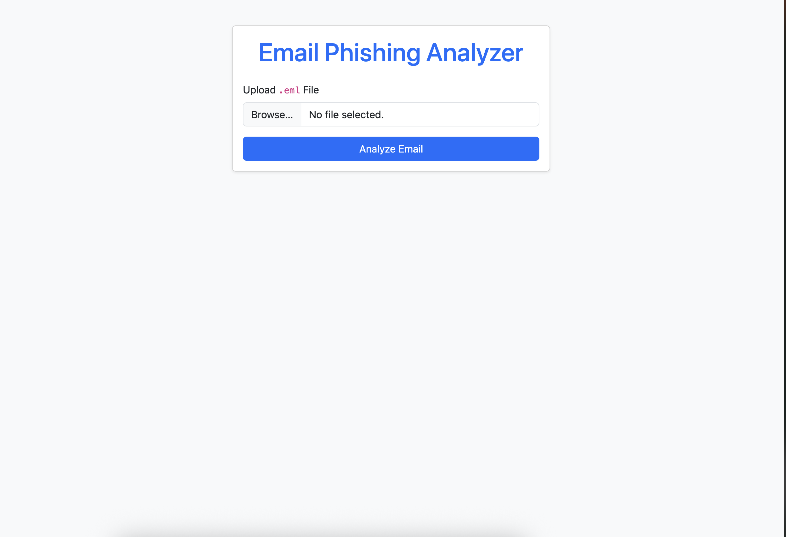
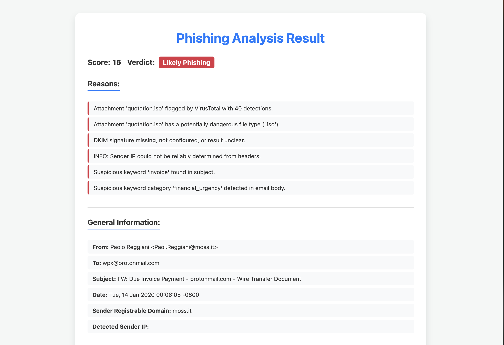
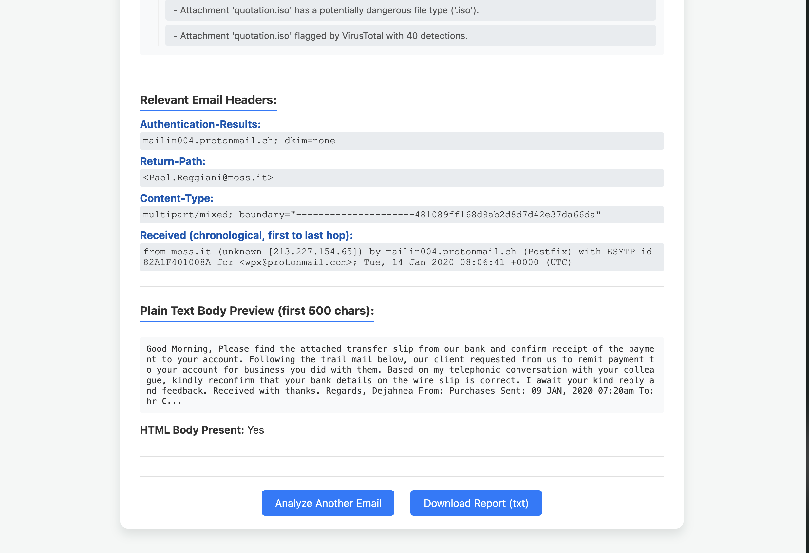

# 🛡️ Phishing Email Analyzer

A web-based tool to analyze `.eml` email files for phishing indicators. Simply upload an email file, and the tool will generate a detailed report and a phishing risk score based on sender, header, URLs, IPs, and attachments.

---

## 📁 Project Structure

```
phishing_analyzer_project/
├── app.py                  # Flask web application entry point
├── analyzer_engine.py      # Core logic for email analysis
├── settings.py             # Configurations and API keys
├── requirements.txt        # Python dependencies
├── analyzers/              # Analysis modules
│   ├── __init__.py
│   ├── utils.py
│   ├── header_analyzer.py
│   ├── ip_analyzer.py
│   ├── url_analyzer.py
│   ├── attachment_analyzer.py
│   └── content_analyzer.py
├── templates/              # HTML templates
│   ├── index.html
│   └── result.html
├── static/                 # Static files (images, CSS, JS)
│   └── images/             # Screenshots for README
├── README.md               # Project documentation
```

---

## ⚙️ Requirements

### 1. Python

- Python 3.7 or higher is recommended.

### 2. Python Dependencies

Create a `requirements.txt` file (already included) with:

```text
Flask>=2.0
requests>=2.25
beautifulsoup4>=4.9
lxml
cchardet
```

Install via:

```bash
pip install -r requirements.txt
```

---

## 🔐 Optional API Keys

To enable full functionality (IP and attachment reputation checks), you can add:

- **AbuseIPDB** - [https://www.abuseipdb.com/](https://www.abuseipdb.com/)
- **VirusTotal** - [https://www.virustotal.com/](https://www.virustotal.com/)

Add your API keys to `settings.py`:

```python
ABUSEIPDB_API_KEY = "YOUR_ABUSEIPDB_API_KEY"
VT_API_KEY = "YOUR_VIRUSTOTAL_API_KEY"
```

> Without these keys, the analyzer will still work but with limited capabilities.

---

## 🛠️ Installation Guide

### Step 1: Clone the Repository

```bash
git clone https://github.com/your-username/phishing-analyzer.git
cd phishing-analyzer
```

### Step 2: Set Up Virtual Environment

```bash
python -m venv venv
```

Activate it:

- **Linux/macOS:** `source venv/bin/activate`
- **Windows:** `.env\Scriptsctivate`

### Step 3: Install Dependencies

```bash
pip install -r requirements.txt
```

### Step 4: Configure API Keys (Optional)

Edit `settings.py` and add your AbuseIPDB and VirusTotal API keys.

---

## 🚀 Running the App

1. Make sure your virtual environment is activated.
2. Run the Flask app:

```bash
python app.py
```

3. Open your browser and navigate to:  
   [http://127.0.0.1:5000/](http://127.0.0.1:5000/)

---

## 🧪 How to Use

- Upload a `.eml` email file on the homepage.
- Click **"Analyze Email"**.
- View results: headers, links, attachments, sender info, and risk score.
- Option to download a report or analyze another email.

---

## 🖼️ Screenshots

### 📥 Upload Email File


### 📊 Analysis Results with Risk Score


### 📄 Option to Download Report


---

## ❌ To Stop the App

Press `CTRL+C` in the terminal.

---

## 📄 License

MIT License. See [LICENSE](LICENSE) for details.

---

## 🙌 Contributions

Pull requests and feature suggestions are welcome!
