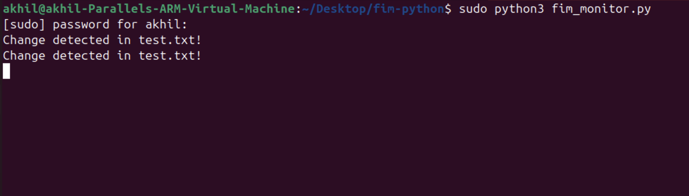
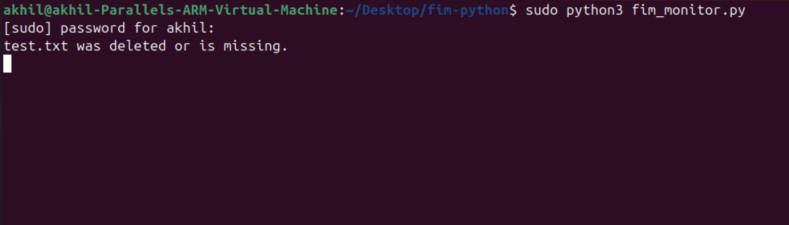

# 🔒 File Integrity Monitoring (FIM) with Python

This is a simple File Integrity Monitoring (FIM) application built in Python. It checks whether critical system files have been changed or deleted by comparing SHA-256 hashes.

---

## 📌 Features

- Monitors critical files like `/etc/passwd`, `/etc/shadow`, or your own test files
- Detects file changes using SHA-256 hashes
- Prints alerts for modified or deleted files
- Runs in an infinite loop and checks at regular intervals
- Easy to test and extend (e.g., Slack alerts, logging)

---

## 🖥️ Demo Screenshots

### ✅ File Change Detected


### ⚠️ Missing File Alert


---

## 🚀 How to Use

### 1. Clone the Repository

```bash
git clone https://github.com/Akhi-hecker/python-projects/python-projects.git
cd python-projects/fim-python
```

### 2. Modify Files to Monitor (Optional)

Edit this list in `fim_monitor.py` if you want to test with your own files:

```python
files_to_watch = ["test.txt"]  # Create this file and edit to test
```

### 3. Run the Script (Test Mode)

We suggest reducing the time for testing:

```python
time.sleep(10)  # Change this line in fim_monitor.py for quick testing
```

Then run:

```bash
python3 fim_monitor.py
```

---

## 🔧 Customize

Edit the `files_to_watch` list to monitor other files or test files:

```python
files_to_watch = ["/etc/passwd", "/etc/shadow", "your_file.txt"]
```

---

## 📂 Project Structure

```
fim-python/
├── fim_monitor.py
├── README.md
├── requirements.txt
└── images/
    ├── terminal-output.png
    └── missing-file.png
```

---

## 📦 Requirements

No external libraries are needed:

```bash
python3 fim_monitor.py
```

If you add Slack support later, you’ll need:

```
pip install requests
```

---

## 🔮 Future Features

- Logging to a file
- Slack or email alerts
- Monitor entire folders
- JSON-based hash storage

---

## 🧑‍💻 Author

**Akhi-hecker**

Connect on GitHub: [github.com/Akhi-hecker](https://github.com/Akhi-hecker)
