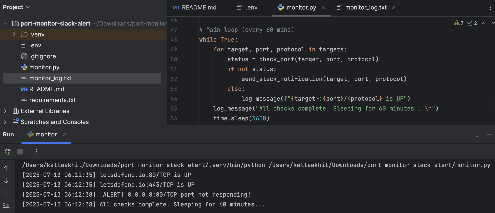
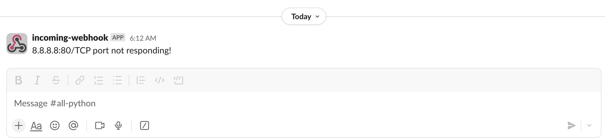

# 🛰️ Port Monitor with Slack Alerts


A Python tool that monitors the availability of specific TCP ports and sends alerts to a Slack channel if a port goes down. It also logs all events with timestamps for auditing or monitoring purposes.

---

## ✨ Features

- 🔍 Scans specific TCP ports on domains/IPs
- 🔔 Sends Slack alerts when a port is unreachable
- 📝 Logs port status to a local file (`monitor_log.txt`)
- 📁 Uses `.env` file for safe config management
- ✅ Easy to run with or without virtual environment

---

## 🚀 Setup Instructions

### ✅ Option 1: Without Virtual Environment (Quick Run)

```bash
pip install -r requirements.txt
python monitor.py
```

### ✅ Option 2: Recommended (With Virtual Environment)

```bash
# Create virtual environment
python -m venv venv

# Activate it
source venv/bin/activate     # On macOS/Linux
venv\Scripts\activate      # On Windows

# Install dependencies
pip install -r requirements.txt

# Run the monitor
python monitor.py
```

---

## ⚙️ Configuration

Create a `.env` file in the same directory with this content:

```env
SLACK_WEBHOOK_URL=https://hooks.slack.com/services/your/webhook/url
```

---

## 🖼️ Results

### ✅ Terminal Log Output

This is an example of the console output when ports are up or down:



---

### 🚨 Slack Alert Notification

This shows a real-time alert in a Slack channel when a port is down:



---

## 📁 Folder Structure

```
port-monitor-slack-alert/
├── monitor.py
├── requirements.txt
├── sample.env
├── README.md
└── assets/
    ├── screenshot-log-output.png
    └── screenshot-slack-alert.png
```

---

## 📦 Dependencies

- `requests` – HTTP request handling
- `python-dotenv` – Load environment variables from `.env`

Install them using:

```bash
pip install -r requirements.txt
```
---

